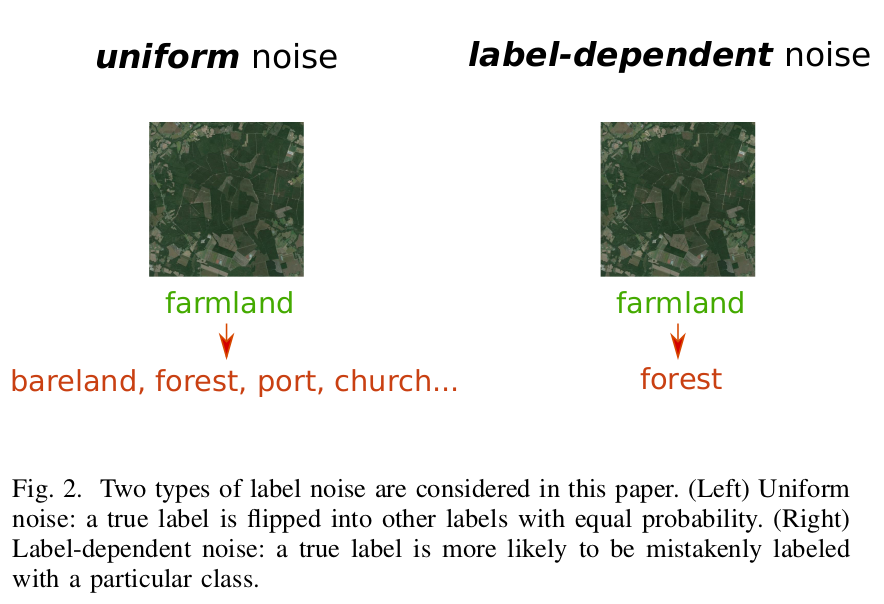
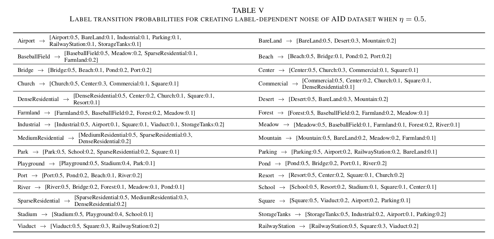
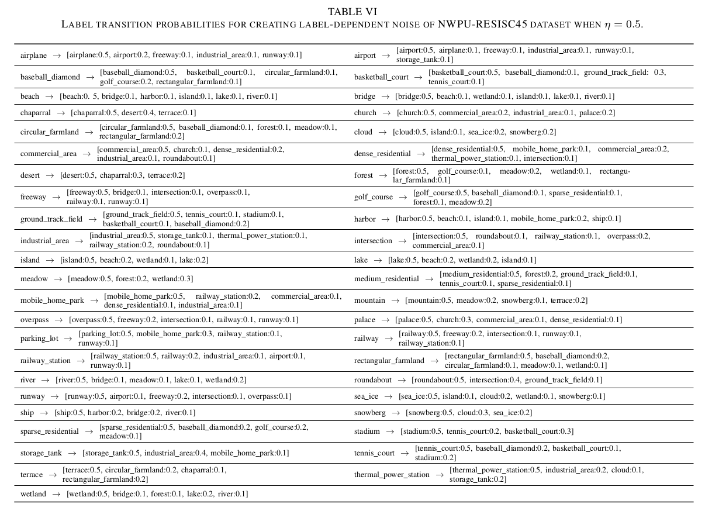

# Robust Normalized Softmax Loss for Deep Metric Learning-based Characterization of Remote Sensing Images with Label Noise
[Jian Kang](https://github.com/jiankang1991), [Ruben Fernandez-Beltran](https://scholar.google.es/citations?user=pdzJmcQAAAAJ&hl=es), [Puhong Duan](https://github.com/PuhongDuan), [Xudong Kang](http://xudongkang.weebly.com/), [Antonio Plaza](https://www.umbc.edu/rssipl/people/aplaza/).

This repo contains the codes for the TGRS paper: [Robust Normalized Softmax Loss for Deep Metric Learning-based Characterization of Remote Sensing Images with Label Noise](). Most deep metric learning-based image characterization methods exploit supervised information to model the semantic relations among the remote sensing (RS) scenes. Nonetheless, the unprecedented availability of large-scale RS
data makes the annotation of such images very challenging, requiring automated supportive processes. Whether the annotation is assisted by aggregation or crowd-sourcing, the RS large-variance problem, together with other important factors [e.g. geo-location/registration errors, land-cover changes, even low-
quality Volunteered Geographic Information (VGI), etc.] often introduce so-called label noise, i.e. semantic annotation errors. In this paper, we first investigate the deep metric learning-based characterization of RS images with label noise and propose a novel loss formulation, named Robust Normalized Softmax Loss
(RNSL), for robustly learning the metrics among RS scenes. Specifically, our RNSL improves the robustness of the Normalized Softmax Loss (NSL), commonly utilized for deep metric learning, by replacing its logarithm function with the negative Box-Cox transformation in order to down-weight the contributions from noisy images on the learning of the corresponding class prototypes. Moreover, by truncating the loss with a certain threshold, we also propose a truncated Robust Normalized Softmax Loss (t-RNSL) which can further enforce the learning of class prototypes based on the image features with high similarities between them, so that the intra-class features can be well grouped and inter-class features can be well separated.

<p align="center">

</p>


## Usage

`train/main.py` is the script of the proposed t-RNSL for training and validation.

`utils/metrics_.py` contains the t-RNSL loss implementation.

`utils/AID_LB_Dependent_P.py` and `utils/NWPU45_Dependent_P.py` contain the pre-defined probability transition matrices of label dependent noise for AID and NWPU45 datasets. 

Some codes are modified from [Pytorch implementation of GCE loss](https://github.com/AlanChou/Truncated-Loss).

<p align="center">

</p>


<p align="center">

</p>

## Citation

```
@article{kang2020trnsl,
  title={{Robust Normalized Softmax Loss for Deep Metric Learning-based Characterization of Remote Sensing Images with Label Noise}},
  author={Kang, Jian and Fernandez-Beltran, Ruben and Duan, Puhong and Kang, Xudong and Plaza, Antonio},
  journal={IEEE Transactions on Geoscience and Remote Sensing},
  year={2020},
  note={DOI:10.1109/TGRS.2020.3042607}
  publisher={IEEE}
}
```

## References

[1] Zhai, Andrew, and Hao-Yu Wu. "Classification is a strong baseline for deep metric learning." *arXiv preprint arXiv:1811.12649* (2018).

[2] Zhang, Zhilu, and Mert Sabuncu. "Generalized cross entropy loss for training deep neural networks with noisy labels." *Advances in neural information processing systems*. 2018.